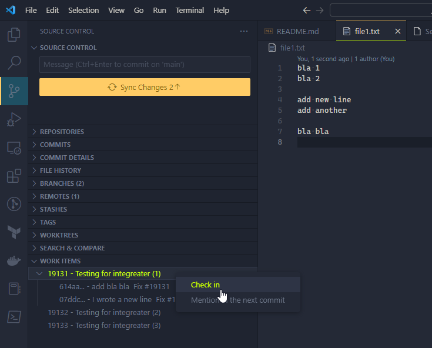

# workitems README

"Work item" based workflow for azure devops git repositories

## Features

This simple very specialized extension supports working with git repositories in azure devops in a way similar to Visual Studio + TFS. It is seamlessly integrated in the built in Git extension of Visual Studio Code.

* Associate commits with work items
* Create pull request based on the work items
* Work all the time on the development branch
* No need to interact with the web gui of devops

### Screenshots
Mention a work item in the upcoming commit message

Check in commits under a work item

## Requirements

* azure devops account

## Extension Settings

This extension contributes the following settings:

* `workItems.organizationUrl` : azure devops server address
* `workItems.project` :Project
* `workItems.personalAccessToken`: The personal access token to login to devops.  See  [Use personal access tokens](https://learn.microsoft.com/en-us/azure/devops/organizations/accounts/use-personal-access-tokens-to-authenticate?view=azure-devops&tabs=Windows) for how to generate one

## Known Issues

To be found.

## Release Notes

### 0.1.0

Initial release

**Enjoy!**
